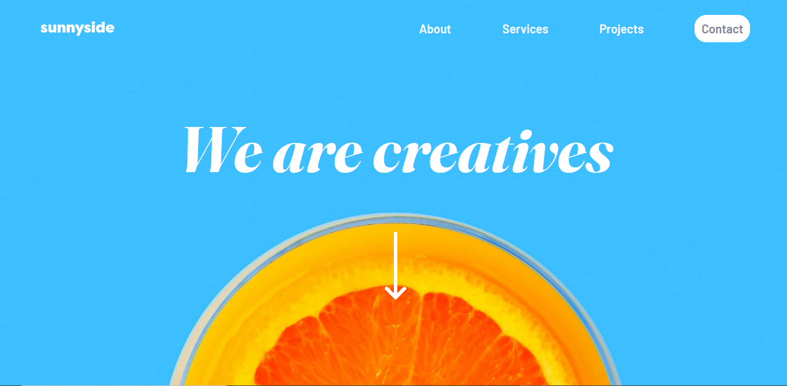
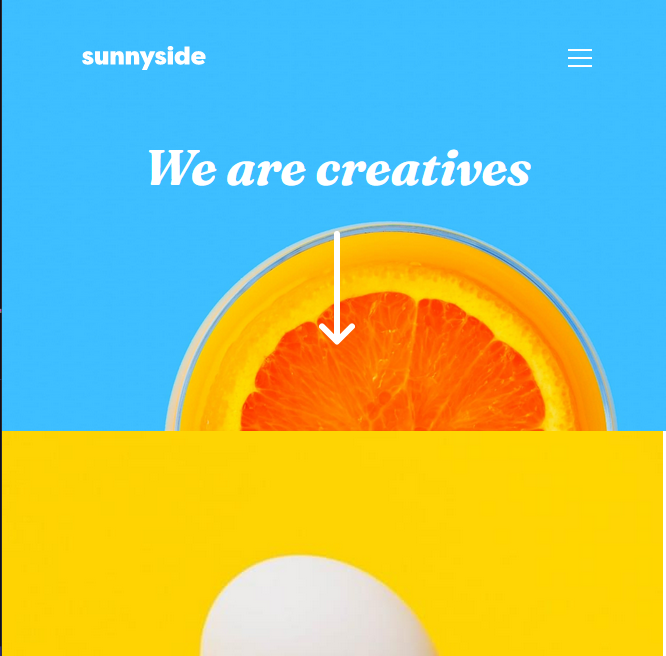

# Frontend Mentor - Sunnyside agency landing page solution

This is a solution to the [Sunnyside agency landing page challenge on Frontend Mentor](https://www.frontendmentor.io/challenges/sunnyside-agency-landing-page-7yVs3B6ef). Frontend Mentor challenges help you improve your coding skills by building realistic projects.

## Table of contents

- [Frontend Mentor - Sunnyside agency landing page solution](#frontend-mentor---sunnyside-agency-landing-page-solution)
  - [Table of contents](#table-of-contents)
  - [Overview](#overview)
    - [The challenge](#the-challenge)
    - [Screenshot](#screenshot)
    - [Links](#links)
  - [My process](#my-process)
    - [Built with](#built-with)
    - [What I learned](#what-i-learned)
    - [Continued development](#continued-development)
    - [Useful resources](#useful-resources)
  - [Author](#author)
  - [Acknowledgments](#acknowledgments)

## Overview

### The challenge

Users should be able to:

- View the optimal layout for the site depending on their device's screen size
- See hover states for all interactive elements on the page

### Screenshot
Desktop:



Mobile:




### Links

- Solution URL: [My soluti](https://www.frontendmentor.io/solutions/responsive-landing-page-with-sass-and-gulp-vdisTnLOX0)
- Live Site URL: [My Live Site](https://purplehippo911.github.io/sunnySide/)

## My process

### Built with

- Semantic HTML5 markup
- CSS custom properties
- Flexbox
- CSS Grid
- Mobile-first workflow
- Sass
- Gulp
### What I learned

I got the chance to practice my CSS Grid skills and working with Sass and Gulp. I didn't necessarily learn something new, I rather practiced on the skills I knew I could need some tinkering with. I also got to practice my responsive skills and writing clean and semantic HTML.

To see how you can add code snippets, see below:

```html
<a href="#" class="logo">
          
        </a>
        <nav class="nav">
          <ul class="nav__list">
            <li class="nav__item">
              <a href="#" class="nav__link">
                <strong>About</strong>
              </a>
            </li>
            <li class="nav__item">
              <a href="#" class="nav__link">
                <strong>Services</strong>
              </a>
            </li>
            <li class="nav__item">
              <a href="#" class="nav__link">
                <strong>Projects</strong>
              </a>
            </li>
            <li class="nav__item">
              <a href="#" class="nav__link --nav__button">
                <strong>Contact</strong>
              </a>
            </li>
          </ul>
        </nav>
        <a class="hamburger" href="#">
          
        </a>
      </div>
      <div class="dropdown">
        <nav class="dropdown__nav">
          <ul class="nav__list">
            <li class="nav__item">
              <a href="#" class="nav__link">
                <strong>About</strong>
              </a>
            </li>
            <li class="nav__item">
              <a href="#" class="nav__link">
                <strong>Services</strong>
              </a>
            </li>
            <li class="nav__item">
              <a href="#" class="nav__link">
                <strong>Projects</strong>
              </a>
            </li>
            <li class="nav__item">
              <a href="#" class="nav__link --nav__button">
                <strong>Contact</strong>
              </a>
            </li>
          </ul>
        </nav>
```

```css
.dropdown {
    width:80%;
    padding:.5rem;
    margin:0 auto;
    margin-top:3rem;
    background:$White;
    position:absolute;
    display:none;
    transition: .9s ease-in-out;
    nav{
        display:flex;
        justify-content:center;
        
    }
    .nav__list {
        padding:2rem;
        flex-direction:column;
        align-items: center;
        gap:2rem;
    }

    .nav__link {
        color:$Darkgrayishblue;
    }

    .--nav__button {
        background:$Yellow;
        color:$VerydarkBlue;
        &:hover{
            background:inherit;
        }
    }
}
```

```js
const hamburger = document.querySelector(".hamburger");
      const dropdown = document.querySelector(".dropdown");

      hamburger.addEventListener("click", (e) => {
        dropdown.classList.toggle("open");
      });
```

### Continued development

Now as I feel quite comfortable with CSS, HTML and other skills like Sass and Gulp, then I'm gonna try to learn a JS framework. I'm thinking of starting with Vue.js and then learning other frameworks like React, if need be. When I feel comfortable enough with that, then I'm thinking of practicing my JS framework in a frontendmentor challenge.


### Useful resources

- [W3 Schools](https://www.w3schools.com/TAGs/tag_source.asp) - This helped me when I forgot how to use the `<picture>`-element and `<source>`-element. 


## Author

- Website - [My website](https://purplehippo911.github.io/website/)
- Frontend Mentor - [@Purplehippo911](https://www.frontendmentor.io/profile/purplehippo911)
- Discord - mashedapples222#7574

## Acknowledgments
I was quite inspired by this soulution, and would recommend you to check it out. This soulution is made by [Davidlloyd8][1] and his teammates. Check out their project here:
[Davidlloyd8's solution](https://github.com/Davidlloyd8/Capstone-3-Project---SunnySide-Agency-Landing-Page)

[1]: https://github.com/Davidlloyd8/